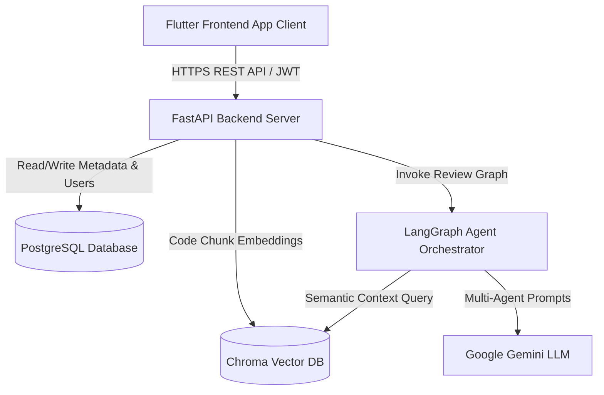
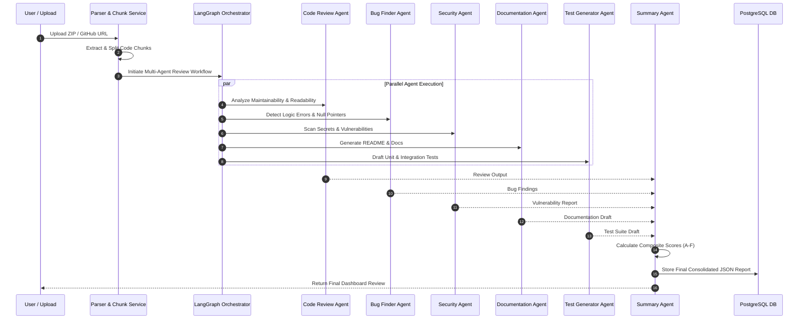

# Multi-Agent Workflow & Architecture Diagrams

## 1. System Architecture

```mermaid
flowchart TD
    Client["Flutter Frontend App Client"]
    API["FastAPI Backend Server"]
    DB[(PostgreSQL Database)]
    VectorDB[(Chroma Vector DB)]
    Orchestrator["LangGraph Agent Orchestrator"]
    Gemini["Google Gemini LLM"]

    Client -->|HTTPS REST API / JWT| API
    API -->|Read/Write Metadata & Users| DB
    API -->|Code Chunk Embeddings| VectorDB
    API -->|Invoke Review Graph| Orchestrator
    Orchestrator -->|Multi-Agent Prompts| Gemini
    Orchestrator -->|Semantic Context Query| VectorDB
```

## 2. Multi-Agent AI Pipeline Flow

```mermaid
sequenceDiagram
    autonumber
    participant U as User / Upload
    participant F as Parser & Chunk Service
    participant LG as LangGraph Orchestrator
    participant CR as Code Review Agent
    participant BF as Bug Finder Agent
    participant SA as Security Agent
    participant DA as Documentation Agent
    participant TG as Test Generator Agent
    participant SUM as Summary Agent
    participant DB as PostgreSQL DB

    U->>F: Upload ZIP / GitHub URL
    F->>F: Extract & Split Code Chunks
    F->>LG: Initiate Multi-Agent Review Workflow
    par Parallel Agent Execution
        LG->>CR: Analyze Maintainability & Readability
        LG->>BF: Detect Logic Errors & Null Pointers
        LG->>SA: Scan Secrets & Vulnerabilities
        LG->>DA: Generate README & Docs
        LG->>TG: Draft Unit & Integration Tests
    end
    CR-->>SUM: Review Output
    BF-->>SUM: Bug Findings
    SA-->>SUM: Vulnerability Report
    DA-->>SUM: Documentation Draft
    TG-->>SUM: Test Suite Draft
    SUM->>SUM: Calculate Composite Scores (A-F)
    SUM->>DB: Store Final Consolidated JSON Report
    SUM-->>U: Return Final Dashboard Review
```
